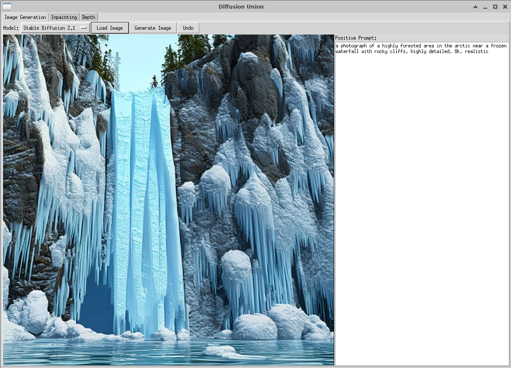

# DiffusionUnion
Adding some application logic around some diffusion models to make their capabilities a little more accessible.

# Prepare the environment
'''
conda create --name du python=3.10
conda activate du
conda install pytorch torchvision torchaudio pytorch-cuda=11.8 accelerate xformers diffusers transformers matplotlib -c pytorch -c nvidia -c xformers -c conda-forge 
pip install tkvideoplayer
'''

# Guide
I've created an application that makes some of the image editing and content creation models more accessible to those who want to work images and avoid the code complexities. You'll need a GPU to run most of these.

## Inpainting
This tab exposes the features of the Stable Diffisuion, Stable Diffusion XL and Kandinsky models for inpainting and the Latent Diffusion Model for super resolution. I've tried to make the UI intuitive by adding tooltips and enabling or disabling the relevant features as the model selection changes for example the negative prompt is only valid for the Kandinsky. The following shows a sequence of operations that I used to generate an image and many other things are possible by adjusting the prompts and mask.

*This was generated with the current prompts by masking out the entire image*