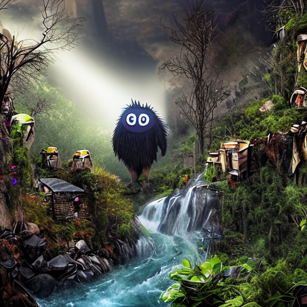
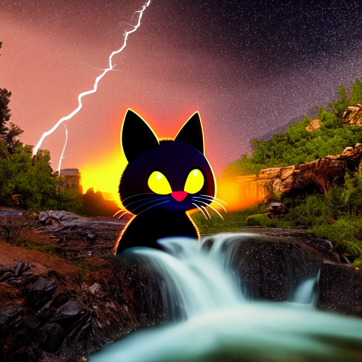
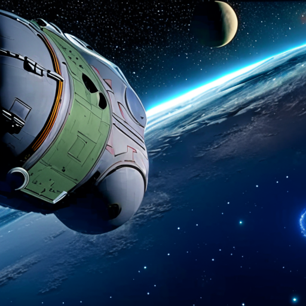
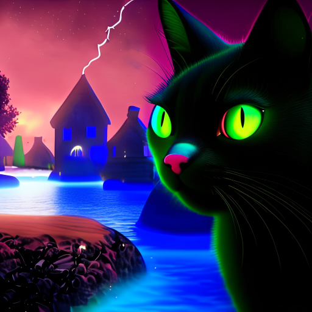
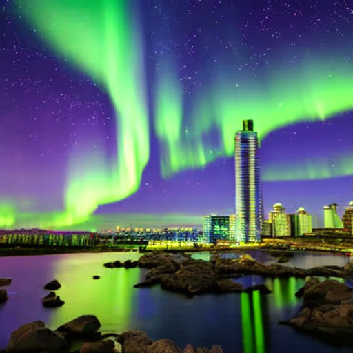
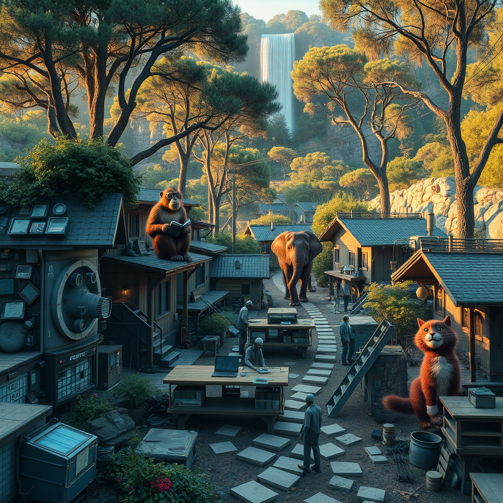
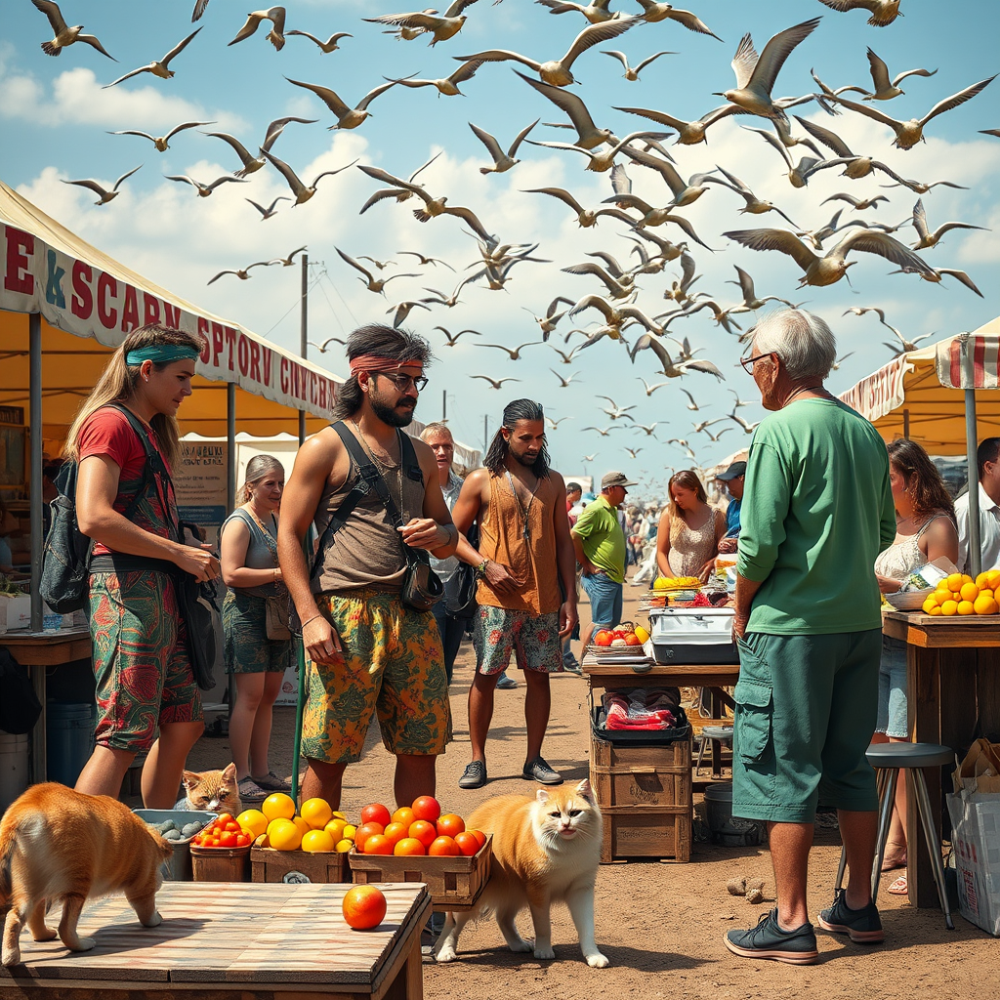

# DiffusionUnion

A desktop application that unifies multiple state-of-the-art generative AI models into an accessible image editing and creation pipeline. Built to demonstrate practical integration of the HuggingFace ecosystem — diffusion models, vision transformers, LoRA adapters, ControlNet, and more — through a cohesive Python/Tkinter GUI.

---

## Tech Stack

| Layer | Technologies |
|---|---|
| **Deep Learning** | PyTorch, HuggingFace Diffusers, HuggingFace Transformers |
| **GPU Acceleration** | CUDA, FP16 precision, xformers memory-efficient attention, CPU offloading |
| **Models** | Stable Diffusion 1.5/2-Depth/XL, SD3, FLUX.1-dev/schnell, FLUX.1-Fill, Kolors, Playground v2.5, Kandinsky 2.2 |
| **Vision** | SAM (Segment Anything), Intel DPT depth estimation, BLIP image captioning, LDM Super Resolution, SD x4 Upscaler |
| **Conditioning** | ControlNet (depth-conditioned SDXL), LoRA weight loading and fusion |
| **UI** | Python Tkinter, multithreaded background inference, PIL/Pillow, NumPy, Matplotlib |

---

## Features

### Image Generation
Text-to-image generation across six model checkpoints selectable at runtime:

- **Stable Diffusion XL** — DPMSolverMultistepScheduler
- **Stable Diffusion 3** — classifier-free guidance with negative prompt
- **FLUX.1-dev** — Black Forest Labs' flow-matching model, bfloat16, up to 1024×1024
- **Kolors** — Kwai's bilingual model with Karras sigma DPM++ scheduling
- **Playground v2.5** — EDMDPMSolverMultistepScheduler for aesthetic quality
- **DiffusionLight chrome ball** — LoRA + ControlNet depth-conditioned inpainting to synthesize a physically-based light probe in-scene; uses Intel DPT for monocular depth estimation and procedural sphere masking via PyTorch tensor math

### Inpainting
Draw a freehand mask directly on the canvas to target regions for model-driven edits:

- **FLUX.1-Fill** — Black Forest Labs' dedicated inpainting model; bfloat16, guidance scale 30, significantly better mask coherence and prompt fidelity than SD-based inpainting
- **Stable Diffusion 1.5 / XL** — `AutoPipelineForInpainting` with configurable mask blur, seed control, and inference step budget
- **Kandinsky 2.2** — prior + decoder architecture with negative prompt support
- xformers memory-efficient attention auto-enabled on PyTorch < 2.0 for older GPU compatibility
- Mask blur via `pipe.mask_processor.blur` for seamless edge blending

### Depth-Conditioned Generation
Uses **Stable Diffusion 2 Depth** (`StableDiffusionDepth2ImgPipeline`) to extract a monocular depth map from the source image and use it as a structural prior, preserving scene geometry while regenerating content.

### Super Resolution
Two 4× upscaling models selectable at runtime:

- **CompVis LDM Super Resolution** (`ldm-super-resolution-4x-openimages`) — fast, no prompt required, designed for small inputs (up to 128×128 → 512×512)
- **Stable Diffusion x4 Upscaler** (`stabilityai/stable-diffusion-x4-upscaler`) — diffusion-based, prompt-guided, handles larger inputs (up to 512×512 → 2048×2048); better suited for FLUX outputs

Both support mask-based region cropping to target a specific area of the image.

### Segmentation & Captioning
- **Segment Anything (SAM ViT-Huge)** — automatic mask generation via `points_per_batch` grid sampling; custom RGBA compositing renders multi-mask overlays with per-mask random colors and configurable transparency
- **BLIP** (`Salesforce/blip-image-captioning-base`) — image captioning via `BlipForConditionalGeneration`, result injected back into the prompt field

---

## Architecture Highlights

- **Modular tab-based UI** — each feature (`image_generation`, `image_inpainting`, `image_depth`, `image_segmentation`) is an independent class, sharing a single session `history` list for a unified undo stack across all operations
- **Non-blocking inference** — all model inference runs on background threads (`threading.Thread`) to keep the UI responsive during GPU-bound workloads
- **Runtime model switching** — pipelines are loaded on demand per generation call, enabling the user to switch between models with different architectures without restarting the app
- **Adaptive VRAM management** — CPU offloading and VAE slicing/tiling are applied conditionally based on detected GPU memory. All models use a shared `_apply_offload` helper with per-model VRAM thresholds (12GB for SDXL-class, 14GB for SD3, 24GB for FLUX). Models that fit in VRAM run at full speed (`pipe.to("cuda")`); smaller GPUs fall back to `enable_sequential_cpu_offload()` automatically. xformers attention is enabled on PyTorch < 2.0 for older GPU compatibility.

---

## Setup

```bash
conda update -n base -c conda-forge conda
conda create --name du python=3.10 -y
conda activate du
python -m pip install -U pip
pip install --pre torch torchvision torchaudio --index-url https://download.pytorch.org/whl/nightly/cu128
pip install -r requirements.txt

```

Download DiffusionLight LoRA weights [here](https://huggingface.co/DiffusionLight/DiffusionLight/tree/main) and place them in the root directory.

A GPU is required. Tested on 16GB VRAM; smaller GPUs are supported via automatic CPU offloading (expect slower inference). Add a `private.py` file with your HuggingFace token to use gated models like Stable Diffusion 3:

```python
hugging_face_token = "hf_..."
```

---

## Sample Output

| | | |
|:---:|:---:|:---:|
||||
||||
||||
||||

The images in this gallery were produced through the multi-step pipeline: text-to-image generation → inpainting to refine regions → depth-conditioned regeneration → LDM super resolution.

---

Actively maintained — reach out with questions or suggestions.
