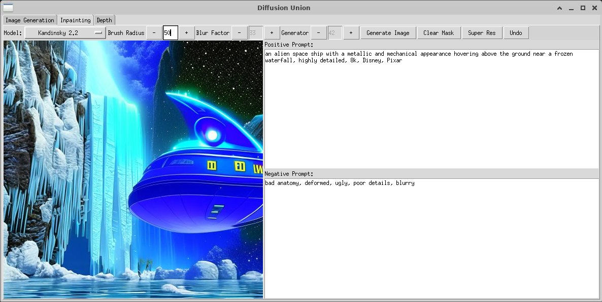

# DiffusionUnion

Adding some application logic around some diffusion models to make their capabilities a little more accessible.

# Prepare the environment

```
conda create --name du python=3.10 -y
conda activate du
python -m pip install -U pip
conda install pytorch torchvision torchaudio pytorch-cuda=11.8 accelerate xformers diffusers transformers matplotlib -c pytorch -c nvidia -c xformers -c conda-forge -y
pip install opencv-python
```

# Guide
This application exposes some of the image editing and content creation capabilities of deep learning models through a graphical user interface. It makes the features more accessible to those who want to avoid the code complexities involved in performing a sequence of these operations using a variety of masks and models. You'll need a GPU to run most of these, mine is 12GB.

## Image Generation
This tab lets you create the initial image which can either be loaded from the file system or generated with the text prompt. Images that have been previously generated or modified are available in the **history** folder.


*This was generated with the current prompt.*


## Inpainting
This tab exposes the features of the Stable Diffusion, Stable Diffusion XL and Kandinsky models for inpainting and the Latent Diffusion Model for super resolution. I've tried to make the UI intuitive by adding tooltips and enabling or disabling the relevant features as the model selection changes for example the negative prompt is only valid for the Kandinsky model.

The following shows a sequence of operations that I used to modify the image generated above. If you don't like the results of any operation there is an undo button to revert them and all generated images are saved in the history folder.


*Mask out the portion of the image that you want to modify and describe the modification in the prompt. The different models excel at creating different images so it may take a few attempts to get good results. Also I find when doing something surreal that I get better results with the Kandinsky model using words like Disney or Pixar in the prompt.*


*This is the result of the last operation.*


*The ship doesn't look right so let's mask out the area we want to fix.*



*This is the result. It doesn't look quite right yet but we'll improve it in the next tab.*


## Depth
This uses the Stable Diffusion 2 depth feature. It takes an image that gets used as a depth map and makes modifications according to the prompt.


*Describe the entire desired image in the prompt.*


*This is what gets generated but it doesn't look quite right so let's do it again.*


*And this is what we get the second time*


## Super Resolution
The super resolution feature is on the Inpainting tab and can be used to produce sharp, larger images.


*Use the mask to select an area of interest.*


*This is the result of that operation which increases the image size by about a factor of 4 in each direction. If it's size is less than 1024x1024 you can use the Stable Diffusion XL model to further increase it to that size*


*And this is the full size 1024x1024 image from the history folder*


## Segmentation
Segmentation is on its own tab and not integrated with the rest of the app due to limitations with the tkinter canvas. The idea is to segment out masks and let the user select which one(s) to use instead of requiring them to be drawn by hand. I may try to build a more featured UI in the future using QT or JavaScript but for now you can use the Segment Anything model as shown below. It was a little tricky getting the visualization code working with the transparencies so wanted to store that here too. Anyway here's how it works.


*Either load or generate an image in the Generation tab and refine it as needed using the Inpainting, Depth and Super Res features.*


*Go to the Segmentation tab and push the Segment button to generate the segmented image.*


*And this is the full size segmented image.*


## Some other generated images

| | | |
|:-------------------------:|:-------------------------:|:-------------------------:|
||||

| | | |
|:-------------------------:|:-------------------------:|:-------------------------:|
||||

| | | |
|:-------------------------:|:-------------------------:|:-------------------------:|
||||


# TODO
I'm adding to this repo in my spare time so stay tuned for new features and feel free to reach out if you have questions or suggestions.

cheers,
brian